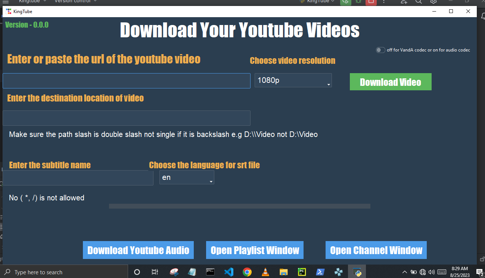
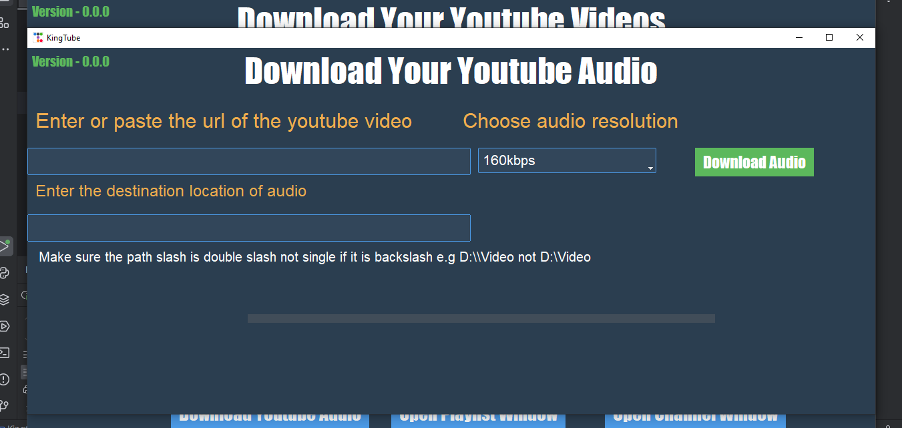
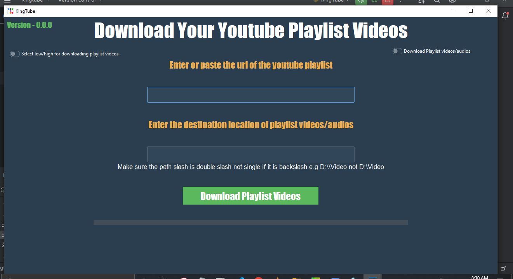

# KingTube
A youtube downloader app written in Python written by me

### Virtual env used:
1. pipenv

### packages i installed from pypi:
1. pytube = "15.0.0"
2. ttkbootstrap = "1.10.1"
3. youtube-transcript-api = "0.6.1"
4. automateyt = "1.0.0"

### In built library:
1. threading
2. tkinter

*I installed pyinstaller globally*

### Version of python:
1. python_version = "3.11.3"
2. pip3 = "23.0.1"
3. pip = "23.2.1"
 
## How To Use The App

### Please note:
 When writing the output dir slash make sure it is
double slash e.g C:\\User not C:\

## Pictures of the app interface

